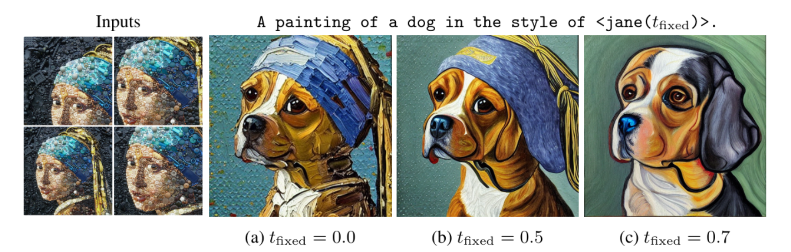

# Multiresolution Textual Inversion




## What does this repo do?

We extend Textual Inversion to learn pseudo-words that represent a concept at different resolutions. This allows us to generate images that use the concept with different levels of detail and also to manipulate different resolutions using language.
Once learned, the user can generate images at different levels of agreement to the original concept: "*A photo of <S(0)>*" produces the exact object while the prompt: "*A photo of <S(0.8)>*" only matches the rough outlines and colors. 
Our framework allows us to generate images that use different resolutions of an image (e.g. details, textures, styles)  as separate pseudo-words that can be composed in various  ways. 


## Get started

## Train (your own) concepts

1. Run: `pip install -r requirements.txt` to install the python dependencies.
2. Get Huggingface token:
    `huggingface-cli login`
3. Create a datasets folder: `mkdir datasets`.
4. Put the images of the concept you want to learn in a folder under the datasets folder. Alternatively, you can run `python scrape_images.py` to download images from some of the most popular concepts. We also provide some datasets used in the Textual Inversion paper and our paper that you can download with the following commands: 
    ```
    gdown --id 1SDdCsKAMplUbWu1FO7hkc_QvGCuNlUqn
    mv datasets.zip datasets && unzip datasets/datasets.zip
    ```
5. Train the model to the new concept! You can either use Textual Inversion or Dreambooth.

    * Training with Textual Inversion:
        ```
        export MODEL_NAME="runwayml/stable-diffusion-v1-5"
        export CONCEPT_NAME="jane"
        accelerate launch train_textual_inversion.py \
            --pretrained_model_name_or_path=$MODEL_NAME  \
            --train_data_dir=datasets/$CONCEPT_NAME \
            --learnable_property="object" \
            --placeholder_token="S" \
            --initializer_token="painting" \
            --output_dir=textual_inversion_outputs/$CONCEPT_NAME \
            --resolution=512 \
            --train_batch_size=1 \
            --gradient_accumulation_steps=4 \
            --max_train_steps=3000 \
            --learning_rate=5.0e-04 \
            --scale_lr \
            --lr_scheduler="constant" \
            --lr_warmup_steps=0
        ```
    * Training with Dreambooth:
        ```
        export MODEL_NAME="runwayml/stable-diffusion-v1-5"
        export CONCEPT_NAME="hitokomoru-style-nao"

        accelerate launch train_dreambooth.py \
        --pretrained_model_name_or_path=$MODEL_NAME  \
        --instance_data_dir=datasets/$CONCEPT_NAME \
        --output_dir=dreambooth_outputs/multires_100/$CONCEPT_NAME \
        --instance_prompt="S" \
        --resolution=512 \
        --train_batch_size=1 \
        --gradient_accumulation_steps=4 --gradient_checkpointing \
        --use_8bit_adam \
        --learning_rate=5e-6 \
        --lr_scheduler="constant" \
        --lr_warmup_steps=0 \
        --max_train_steps=100
        ```

## Generate samples

### Generate samples with Textual Inversion

Here, we show how to use the learned concepts to generate samples at different resolutions with Textual Inversion. If you did train your own concepts, do not worry, we provide some pre-trained concepts that you can download with the following commands:

```
gdown --id 1HhksfGmQh6xAiS2MIi6kMe430iHl2PGj
unzip textual_inversion_outputs
mv outputs textual_inversion_outputs
```

Once you have trained (or downloaded) the learned concepts, you can create images at different resolutions, as shown below:

```
from pipeline import MultiResPipeline, load_learned_concepts
import torch
model_id = "runwayml/stable-diffusion-v1-5"
pipe = MultiResPipeline.from_pretrained(model_id, torch_dtype=torch.float16, revision="fp16", use_auth_token=True)
pipe = pipe.to("cuda") 


string_to_param_dict = load_learned_concepts(pipe, "textual_inversion_outputs/")
image = pipe("An image of a <cat-toy(0)>", string_to_param_dict)[0]
loc = f"out_image.png"
image.save(loc)
```

### Generate samples with Dreambooth

Here, we show how to use the learned concepts to generate samples at different resolutions with DreamBooth.

Once you have trained (or downloaded) the learned concepts, you can create images at different resolutions, as shown below:

```
from pipeline import DreamBoothMultiResPipeline
import torch
model_id = "runwayml/stable-diffusion-v1-5"
pipe = DreamBoothMultiResPipeline.from_pretrained("dreambooth_outputs/multires_800/stan-smith", use_auth_token=True)
pipe = pipe.to("cuda")
image = pipe("An image of a <S(0)>", string_to_param_dict)[0]
loc = f"out_image.png"
image.save(loc)
```
